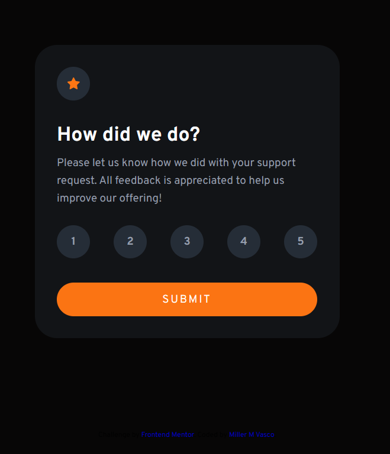
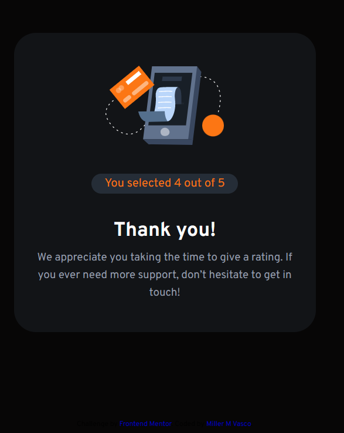

# Desafio Frontend Mentor - Interactive Rating Component

Este repositório contém a solução para o desafio do site Frontend Mentor, o Interactive Rating Component. Neste desafio, o objetivo era criar um componente de classificação interativo usando HTML, CSS e JavaScript.

## Visão Geral do Desafio

O desafio consistia em construir um componente de classificação onde os usuários pudessem avaliar um produto ou serviço. O componente deveria permitir que o usuário selecionasse uma classificação desejada, exibindo visualmente a seleção e atualizando a exibição da classificação escolhida. Além disso, o desafio solicitava que o componente tivesse uma animação suave ao selecionar uma classificação.

## Preview do Desafio Concluído

Você pode conferir a versão final do desafio hospedada [aqui](https://xx-mill3r-xx.github.io/interactive-rating-component_Challenge/).

## Tecnologias Utilizadas

- HTML5
- CSS3
- JavaScript

## Aprendizados e Desafios

Durante a resolução deste desafio, pude praticar a estruturação do HTML, a estilização do componente usando CSS e a adição de interatividade com JavaScript. Aprendi técnicas para manipular elementos do DOM, adicionar eventos de clique e atualizar a aparência visual do componente com base nas interações do usuário.

Um dos desafios que enfrentei foi criar uma animação suave ao selecionar uma classificação, garantindo uma transição fluida e agradável para o usuário. Além disso, também trabalhei para tornar o código limpo, organizado e seguindo as melhores práticas de desenvolvimento web.

## Contribuição

Contribuições não são aceitas neste repositório, pois se trata de uma solução individual para um desafio específico. No entanto, sinta-se à vontade para explorar o código, fazer fork do repositório e adaptá-lo de acordo com suas necessidades.
